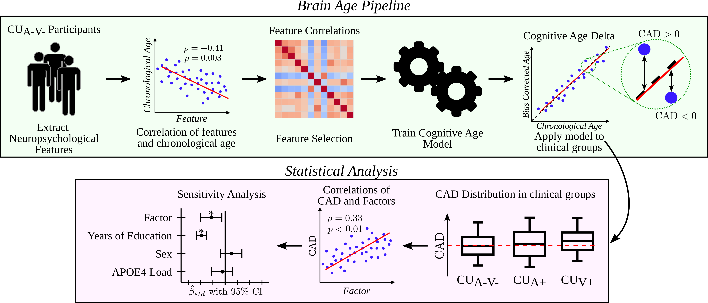

# Cognitive Age Delta as a Marker of Healthy and Pathological Cognitive Aging: The Role of Lifestyle, Cognitive Reserve, and Vascular Risk
This repository contains the code we used for the manuscript, submitted to the Journal of Clinical Medicine (JCM), for transparency.

No data was added as it is not intended to be shared.

